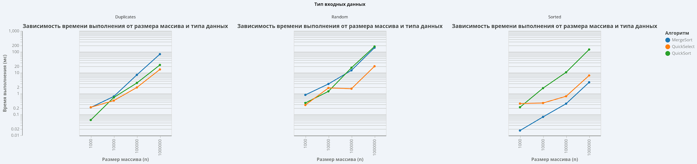

# Report for Laboratory Work 1: Sorting Algorithms Analysis

**Student:** Nursultan Malgazhdar, Group SE2516 (Astana IT University)

## 1. Introduction and Test Conditions
In this work, I implemented and analyzed three algorithms: **MergeSort**, **QuickSort**, and **QuickSelect**.

I tested each algorithm on arrays of different sizes: N = 1,000, 10,000, 100,000, and 1,000,000. To get accurate results, I ran each test 5 times and used the median value to avoid "cold start" issues.
I used three types of arrays:
1. **Random:** Arrays with random numbers.
2. **Sorted:** Arrays that are already sorted from smallest to largest.
3. **Duplicates:** Arrays with many repeating numbers (using only numbers from 0 to 9).

## 2. Performance Visualization
The chart below shows the overall execution time (in milliseconds, logarithmic scale) for all implemented algorithms across different data types and array sizes.

## 3. MergeSort Analysis

**Code Optimizations:**
* Used a single memory buffer (array `temp`) to avoid creating new objects during recursion.
* Added an "Insertion Sort cutoff". If the array size is 15 or less, the algorithm uses Insertion Sort because it is faster for small data.
* Skipped the merge step if the two array halves are already sorted.

**Results for N = 1,000,000:**
* **Random:** 156.8 ms, 19.9 million comparisons. Max depth: 18.
* **Sorted:** 3.4 ms, 999,999 comparisons. Max depth: 18.

**Conclusion:**
As seen in the chart, MergeSort shows classic $O(N \log N)$ complexity for random data. For sorted data, the algorithm worked in linear $O(N)$ time (only 3.4 ms) because of the optimization that skips the merge step. The recursion depth is stable and never goes over 18 levels.

## 4. QuickSort Analysis

**Code Optimizations:**
* **Random Pivot:** Chooses a random element as the pivot to avoid the worst-case scenario.
* **3-way Partition:** Divides the array into three parts (<, ==, >).
* **StackOverflow Protection:** The recursion always goes into the smaller half of the array first.

**Results for N = 1,000,000:**
* **Random:** 179.4 ms, 37.7 million comparisons. Max depth: 13.
* **Sorted:** 128.6 ms, 36.9 million comparisons. Max depth: 13.
* **Duplicates:** 23.3 ms, 5.5 million comparisons. Max depth: 2.

**Conclusion:**
The random pivot successfully protects the algorithm from the $O(N^2)$ worst case on sorted arrays. Usually, sorting a sorted array of 1,000,000 elements causes a `StackOverflowError`, but our algorithm did it in 128 ms. The biggest success is the 3-way partition: on the array with duplicates, the execution time dropped significantly to just 23.3 ms, and the recursion depth was only 2. It groups all equal elements perfectly.

## 5. QuickSelect Analysis

This algorithm finds the k-th smallest element. In our tests, it searched for the median ($k = N/2$).

**Results for N = 1,000,000:**
* **Random:** 20.2 ms, 4.0 million comparisons.
* **Sorted:** 7.3 ms, 4.4 million comparisons.
* **Duplicates:** 14.2 ms, 2.8 million comparisons.

**Conclusion:**
Unlike QuickSort, which takes 179 ms to sort the whole array, QuickSelect finds the median in just 20.2 ms. This proves that QuickSelect works in linear time $O(N)$ because it ignores half of the array at each step and does not sort the whole data.

## 6. Final Conclusion
All algorithms work correctly and fast. The code optimizations (like 3-way partition, random pivot, and memory control) made them highly stable. The algorithms are now protected from memory errors and work efficiently on any type of data distribution.